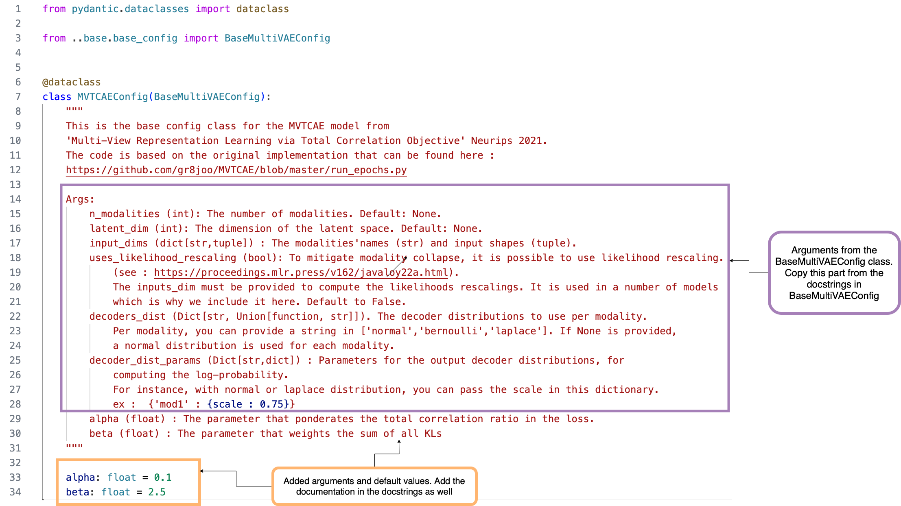
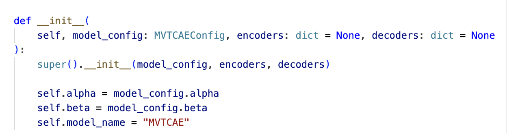
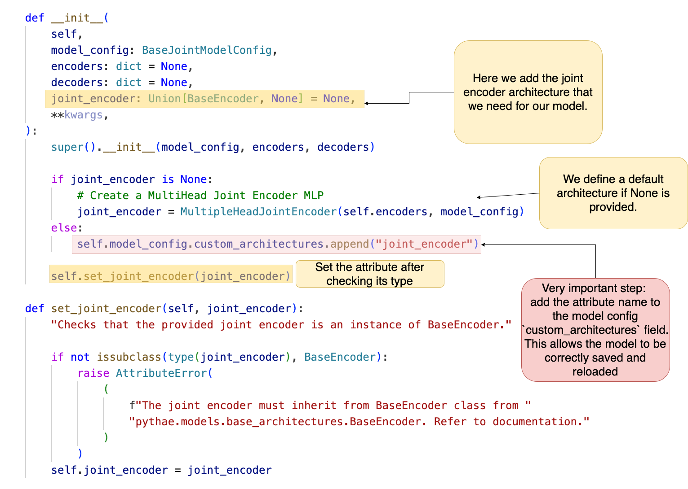
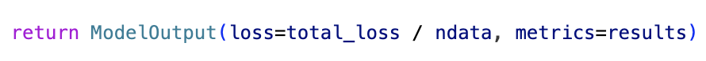
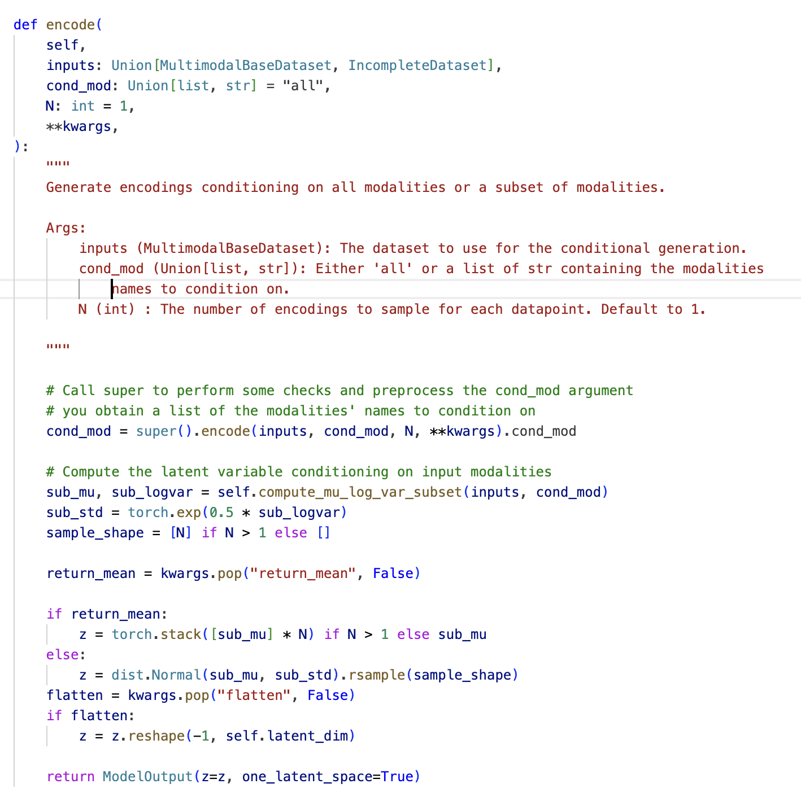
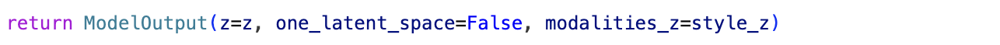

# Welcome to the contributing guidelines !


## Contributing guidelines for the MultiVae library

If you want to contribute to this repo, please consider following this checklist

1) Fork this repo
2) Clone it on your local drive and install the library in editable mode
```bash
$ git clone git@github.com:your_github_name/MultiVae.git
$ cd MultiVae
$ pip install -e .
```
3) Create a branch with an explicit name of your contribution
```bash
$ git checkout -b my_branch_with_contribution
```
4) Make sure you add the appropriate tests to test your feature. If the library test coverage reduces
significantly, the contribution will raise some red flags.

5) Ensure that your contribution passes the existing test suite by running
```bash
pytest tests/
``` 
6) Polish your contribution using reformatting tools like black and isort. See (https://black.readthedocs.io/en/stable/getting_started.html and https://pycqa.github.io/isort/index.html for details on those tools. )

7) Finally, open a pull request directly on your Github ! :rocket: 


## Implementing a new model
If you want to add a new model please make sure that you follow the checklist below:

- [ ] Create a folder named `your_model_name` in `multivae/models` and containg a file with the model implementation entitled `your_model_name_model.py` and a file with the model configuration named `your_model_name_config.py`.

### Implementing the config class for your model

- [ ] The `your_model_name_config.py` files contains a dataclass `your_model_name_Config` inheriting from `BaseMultiVAEConfig`. In this class you can define all the configuration arguments that you need for your model that aren't already defined in the `BaseMultiVAEConfig` class. For an example see the explained config class for `multivae/mvtcae/mvtcae_config.py` below :




 Make sure to add a docstring that explain all added arguments.


### Implementing the model class

- [ ] The `your_model_name_model.py` file contains a class with the name of your model inheriting from `BaseMultiVAE`. If your model has the structure of a joint encoder model, it can also inherit from the `BaseJointModel` class. 

Below you can find a simple example of a model `__init__` function taken from the MVTCAE model. 


Set the `self.model_name` attribute in the init. 
All models inheriting from the `BaseMultiVAE` class are considered to have a dictionary of encoders and a dictionary of decoders as attributes. Calling the 
`super().__init__(model_config, encoders, decoders)`  function sets up the encoders and decoders providing default architectures if None are given. 

**If you have additional architectural components in your model, follow the example below from `joint_model.py`**:


The additional architectural components must be passed as inputs to the model init. Set the architecture as an attribute during instantiation and add the attribute name to the `self.model_config.custom_architectures` list so that the model will be correctly saved and reloaded when using the `BaseMultiVAE` functions.

Apart from the `__init__`, you need to implement the `forward` function. The output of the forward function is a `pythae.models.base.ModelOutput` instance that must contain a **loss** field for the trainer. It must also contain a **metrics** field which contains a dictionary of different values that you which to monitor during training. This metrics field will be passed to callbacks during training for logging. If you don't have any metrics to monitor, you can just return `metrics = {}`.



Finally you need to define the `encode` function, that will be used for cross-modal generation. See the example below from the MVAE model. 


The `encode` function returns a `pythae.models.base.ModelOutput` instance containing a field `z` which are the latent variables obtained from encoding the input considering the modalities in `cond_mod`.
When the model only consider one latent space for decoding, the output has a field `one_latent_space` that is set to True. 
When the model has multiple latent spaces, one shared and one private to each modality (see the MMVAE+, or the MoPoE model for instance), this field is set to False and there is an additional field `modalities_z` that contains a dictionary with the private latent variables for each modality. 


- [ ] Add a test file for your model in the `MultiVae/tests/` folder. Since the tests are pretty similar from one model to another you can implement your tests by taking the inspiration from `test_mvtcae.py` file. Run `pytest tests/` to run the tests. 

- [ ] In order for your model to benefit from the AutoModel reloading functionalities, add your model to the `multivae/models/auto_model/auto_config.py`. In the `AutoConfig` dataclass add the following lines:
```python
        elif config_name == "your_model_nameConfig":
            from ..your_model_module import your_model_nameConfig

            model_config = your_model_nameConfig.from_json_file(json_path)

```
- [ ] Do the same thing for the `AutoModel` class, by adding the following lines:

```python
        elif model_name == "your_model_nameConfig":
            from ..your_model_module import your_model_name

            model = your_model_name.load_from_folder(dir_path)
``````


## Implementing a new sampler

If you want to add a new sampler please make sure that you follow the checklist below: 

- [ ] Create a folder named `your_sampler_name` in `multivae/samplers` and containing a file with the sampler implementation entitled `your_sampler_name_sampler.py` and a file with the sampler configuration (if needed) named `your_sampler_name_config.py`. See `multivae/samplers/gaussian_mixture` for instance.
- [ ] The `your_sampler_name_sampler.py` files contains a class with the name of your sampler inheriting from `BaseSampler`.
- [ ] The `your_sampler_name_config.py` files contains a dataclass inheriting from `BaseSamplerConfig`. See `multivae/samplers/gaussian_mixture/gaussian_mixture_config.py`.
- [ ] The sampler must have a `sample` method that returns an output that has the same format than the output of the encode function of the model it is used with. That is, if the model is uses a unique latent space, the output of the sampler function must look like `ModelOutput(z = z, one_latent_space = True)`, else if the model has additional private latent spaces for each modality the output must look like `ModelOutput(z=z, one_latent_space = False, modalities_z = dict_private_z)`.
As inspiration, see the sample function of the gaussian mixture sampler. 

- [ ] If the sampler needs to be fitted, a `fit` method can be implemented. See `multivae/samplers/gaussian_mixture/gaussian_mixture_samplers.py` for example.

- [ ] Make your tests in the `tests` folder. The tests for your sampler can be added to the `test_samplers.py` file. The tests for different samplers are rather similar so you can use the test for the gaussian mixture sampler as an inspiration for implementing your tests.

## Implementing a new metric

If you which to implement a new metric, make sure that you follow the checklist below:
- [ ] Create a new folder named `your_metric_name` in the `multivae/metrics` folder and containing a file with the metric implementation called `your_metric_name.py` and a file with the metric configuration (if needed) named `your_metric_name_config.py`. See `coherences` for an example. 
- [ ] The `your_metric_name.py` contains the a class with the name of your metric inheriting from the `Evaluator` class which is the base class for evaluation metrics.
- [ ] The `your_metric_name_config.py` contains a dataclass inheriting from `EvaluatorConfig` which is the base configuration class for evaluation modules. 
- [ ] Your metric can has as many functions as you want. For instance the `Coherences` class has a function for cross modal coherences and a function for joint coherence. But in any case, your metric must have an `eval` method (that might call other methods) that returns a `pythae.models.base.ModelOutput` instance. 
- [ ] Once again, make some tests in the tests folder. You can add them directly to the `test_metrics.py` file while taking the tests for existing metrics as inspiration. 

## Implementing a new dataset class

If you which to implement a new multimodal dataset class, make sure that you follow the checklist below:

- [ ] create a file entitled `your_multimodal_dataset.py` in the `multivae/data/datasets` folder. 
- [ ] This file must contain your dataset class that must inherit from the `MultimodalBaseDataset`. 
- [ ] Since this class inherits from the pytorch Dataset class, it must have a method ` def __len__(self):` that returns the number of items in the dataset.
- [ ] It must also have a `__getitem__(self, index)` method that returns a `DatasetOutput` instance with a field `data` containing a dictionary with the modalities names and values. If labels are available, the DatasetOutput instance can also have a field `labels` containing a 1d torch.Tensor with the labels values. 
- [ ] If the dataset is incomplete, your class must inherit from the `IncompleteDataset` class. The output returned by the `__getitem__` method should have a `masks` field containing a dictionary with modalities names and availabilities for each sample. As an example see the MMNIST dataset. 
- [ ] In the docstrings of the dataset class, please provide information on how to download the data and preprocess it if it is not handled directly by the dataset class. 

## Any doubts ?
In any case if you have any question, do not hesitate to reach out! :smile:
