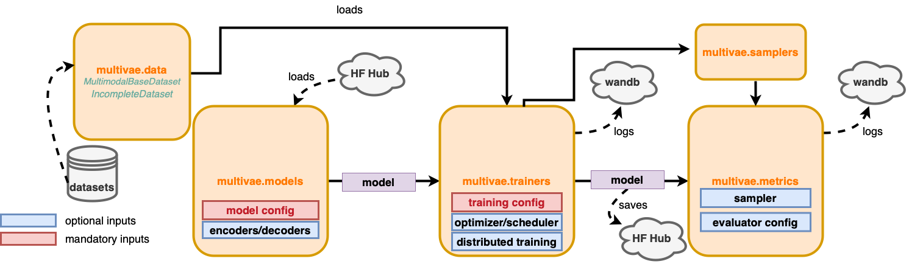

# Structure of the library

Our implementation is based on PyTorch and is inspired by the architecture
of [Pythae](https://pythae.readthedocs.io/en/latest/). The implementations of the models
are collected in the module `multivae.models`. Each model class is accompanied by a configuration dataclass gathering the collection of any relevant hyperparameter which enables them to be saved and loaded straightforwardly. The models are
implemented in a unified way, so that they can be easily integrated within the `multivae.trainers`.
Trainers are also accompanied by a training configuration dataclass used
to specify any training-related hyperparameters (number of epochs, optimizers, schedulers, etc..).
Models that have a multistage training (JNF, TELBO) benefit from their dedicated trainer that makes
them as straightforward to use as other models. Partially observed datasets can be
conveniently handled using the `IncompleteDataset` class that contains masks informing on missing
or corrupted modalities in each sample. For Data Augmentation purposes the module `multivae.samplers` regroups different ways generating fully synthetic data. 
Finally, the MultiVae library also integrates an evaluation
pipeline for all models with common metrics such as likelihoods, coherences, FID scores and
visualizations implemented in the module `multivae.metrics`.

