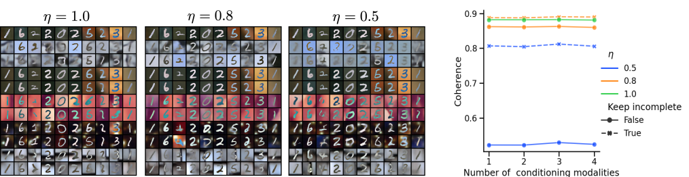

# Case Study 1

## How does the MMVAE+ model perform in case of missing data ? 

As an aggregated model the MMVAE+ benefits of a natural adapted objective for the partially observed setting, where for each sample, the objective is
computed for the largest available subset of modalities. See the [documentation]( 
https://multivae.readthedocs.io/en/latest/models/multimodal_vaes/mmvae_plus.html) for more details. 

### Description of the case-study: 

We evaluate our implementation of the MMVAE+ model on the PolyMNIST dataset with missing data. 
We consider 3 percentages of missing data : 0% (complete), 20%, and 50%. 

We use the same architectures as in the original paper and set beta = 2.5. 

We visualize generated samples and compute the cross-modal coherences. Each experiment is repeated on four different seeds. 

### How can I replicate the experiments ? 

All you need is to have the MultiVae library installed and one additional script you can find [here](https://github.com/AgatheSenellart/MultiVae/tree/main/examples/case_studies/mmvaePlus_on_partial_data/results.md).

First configure the paths at the top of the file:

``` python
DATA_PATH = "/home/user/data"
SAVE_PATH = "/home/user/experiments/mmvaePlus_on_partial"
```

and then run the script with the option you want:
``` bash
python train.py --keep_incomplete --missing_ratio 0.2 --seed 0
```
You have three arguments you can pass: 
- `--keep_incomplete`: means that we don't discard incomplete multimodal samples but try to learn using them
- `--missing_ratio`: either 0.2, 0.5 or 0. It is the ratio of missing data. 
- `--seed`: the seed for the experiment. 

The script uses wandb to monitor the training, but if you don't want that, you can simply comment the lines that configure the wandb callback.

### What are the results ?

After running all the experiments, we have the results on the wandb workspace [here](https://wandb.ai/multimodal_vaes/mmvaePlus_on_partial_mmnist/workspace?nw=nwuserasenellart).

We export the results from wandb to do some custom plots:


In the figure above,  η is the fraction of *remaining* data. 
We see that the quality of the generation stays robust even with missing data! We also see that keeping the incomplete samples in the training set is much more interesting than discarding them. 