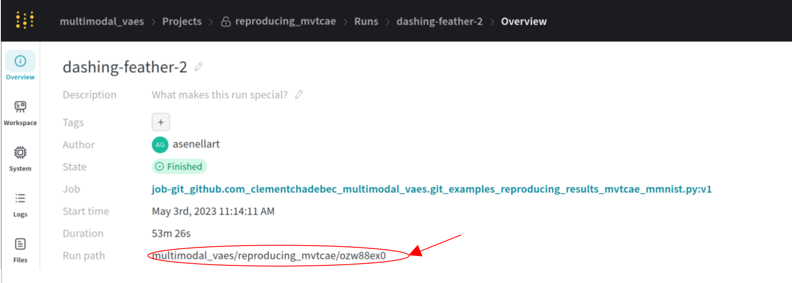

***************************************************
Where to find the WandB path for a trained model ?
***************************************************

When you instantiate an Evaluator to compute metrics, you can pass a ``wandb_path`` to 
indicate where you want the metrics to be logged in WandB. 

If you want to create a new WandB run for these metrics, you can do:

.. code-block:: python

    >>> import wandb
    >>> run = wandb.init(entity = your_entity, project=your_project)
    >>> wandb_path = run.path

    >>> from multivae.metrics import CoherenceEvaluator, CoherenceEvaluatorConfig
    >>> coherence_config = CoherenceEvaluatorConfig(
    ...     batch_size = 128,
    ...     wandb_path = wandb_path,
    ...     num_classes = 10
    ... )
    >>> CoherenceEvaluator(
    ...     model = model,
    ...     classifiers = classifiers,
    ...     test_set = test_data,
    ...     eval_config = coherence_config
    ... )

However you might want to log the metrics to the same WandB run that you used for training. 
To do so, you need to retrieve the `wandb_path` used for training:

* Either from the training folder:

    .. code-block:: python
        
        >>> from multivae.trainers.base.callbacks import load_wandb_path_from_folder
        >>> wandb_path = load_wandb_path_from_folder('dir_path')

* Or from the WandB online page for your run 

