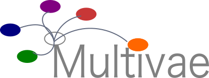
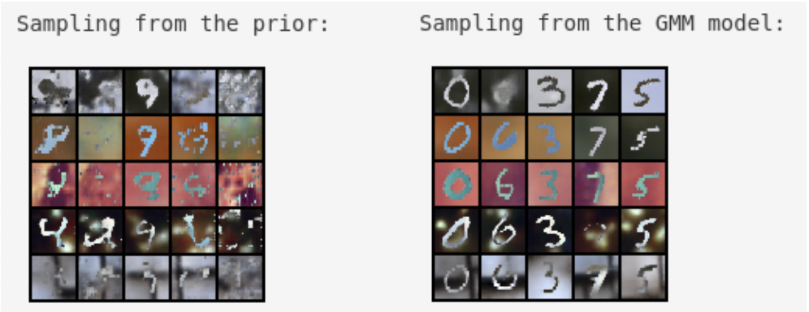

<!-- Add buttons here -->
<p align="center">
 <a>
	    
	</a>
	<a href='https://multivae.readthedocs.io/en/latest/?badge=latest'>
    	
	</a>
    <a href='https://opensource.org/licenses/Apache-2.0'>
	    
	</a>
    <a>
	    
	</a>
    <a href="https://codecov.io/gh/AgatheSenellart/MultiVae" > 
         
    </a>
</p>

# Implemented models 

|Model|Paper|Official Implementation|
|:---:|:----:|:---------------------:|
|CVAE|[An introduction to Variational Autoencoders](https://arxiv.org/abs/1906.02691) |  |
|JMVAE|[Joint Multimodal Learning with Deep Generative Models](https://arxiv.org/abs/1611.01891)|[link](https://github.com/masa-su/jmvae)|
|TELBO|[Generative Models of Visually Grounded Imagination ](https://openreview.net/forum?id=HkCsm6lRb)|[link](https://github.com/google/joint_vae)|
|MVAE| [Multimodal Generative Models for Scalable Weakly-Supervised Learning](https://proceedings.neurips.cc/paper/2018/hash/1102a326d5f7c9e04fc3c89d0ede88c9-Abstract.html)|[link](https://github.com/mhw32/multimodal-vae-public)|
|MMVAE|[Variational Mixture-of-Experts Autoencoders for Multi-Modal Deep Generative Models](https://proceedings.neurips.cc/paper/2019/hash/0ae775a8cb3b499ad1fca944e6f5c836-Abstract.html)|[link](https://github.com/iffsid/mmvae)|
|MoPoE| [Generalized Multimodal ELBO](https://openreview.net/forum?id=5Y21V0RDBV)|[link](https://github.com/thomassutter/MoPoE)|
|MVTCAE | [Multi-View Representation Learning via Total Correlation Objective](https://proceedings.neurips.cc/paper/2021/hash/65a99bb7a3115fdede20da98b08a370f-Abstract.html)|[link](https://github.com/gr8joo/MVTCAE/)|
DMVAE| [Private-Shared Disentangled Multimodal VAE for Learning of Latent Representations](https://www.computer.org/csdl/proceedings-article/cvprw/2021/489900b692/1yZ4y9uUPfi)|[link](https://github.com/seqam-lab/DMVAE) | 
|JNF| [Improving Multimodal Joint Variational Autoencoders through Normalizing Flows and Correlation Analysis](https://arxiv.org/abs/2305.11832) | x |
|MMVAE + |[MMVAE+: ENHANCING THE GENERATIVE QUALITY OF MULTIMODAL VAES WITHOUT COMPROMISES](https://openreview.net/forum?id=sdQGxouELX) | [link](https://openreview.net/forum?id=sdQGxouELX)|
|Nexus | [Leveraging hierarchy in multimodal generative models for effective cross-modality inference](https://www.sciencedirect.com/science/article/abs/pii/S0893608021004470)|[link](https://github.com/miguelsvasco/nexus_pytorch)|
|CMVAE| [Deep Generative Clustering with Multimodal Diffusion Variational Autoencoders](https://openreview.net/forum?id=k5THrhXDV3)| [link](https://github.com/epalu/CMVAE)|
|MHVAE| [Unified Brain MR-Ultrasound Synthesis using  Multi-Modal Hierarchical Representations](https://arxiv.org/abs/2309.08747) |[link](https://github.com/ReubenDo/MHVAE)|
|CRMVAE| [Mitigating the Limitations of Multimodal VAEs with Coordination-Based Approach](https://openreview.net/forum?id=Rn8u4MYgeNJ) | [link](https://openreview.net/forum?id=Rn8u4MYgeNJ)|


# Installation
To get the latest stable release run:

```shell
pip install multivae
```

To get the latest updates from the github repository run: 

```shell
git clone https://github.com/AgatheSenellart/MultiVae.git
cd MultiVae
pip install .
```
Cloning the repository also gives you access to the tutorial notebooks and scripts in the 'example' folder.

# Quickstart

Here is a very simple code to illustrate how you can use MultiVae:
```python
# Load a dataset 
from multivae.data.datasets import MnistSvhn

train_set = MnistSvhn(data_path="./data", split="train", download=True)


# Instantiate your favorite model:
from multivae.models import MVTCAE, MVTCAEConfig

model_config = MVTCAEConfig(
    n_modalities=2,
    latent_dim=20,
    input_dims={"mnist": (1, 28, 28), "svhn": (3, 32, 32)},
)
model = MVTCAE(model_config)


# Define a trainer and train the model !
from multivae.trainers import BaseTrainer, BaseTrainerConfig

training_config = BaseTrainerConfig(learning_rate=1e-3, num_epochs=10)

trainer = BaseTrainer(
    model=model,
    train_dataset=train_set,
    training_config=training_config,
)
trainer.train()
```

# Tutorials


Our library allows you to use any of the models with custom configuration, encoders and decoders architectures and datasets easily. To learn how to use MultiVae's features we propose different tutorial notebooks:

- [Getting started](https://github.com/AgatheSenellart/MultiVae/tree/main/examples/tutorial_notebooks/getting_started.ipynb) : Learn how to provide your own architectures and train a model.
- [Computing Metrics](https://github.com/AgatheSenellart/MultiVae/tree/main/examples/tutorial_notebooks/computing_visualization_and_metrics.ipynb) : Learn how to evaluate your model using MultiVae's metrics modules.
- [Learning with partial datasets](https://github.com/AgatheSenellart/MultiVae/tree/main/examples/tutorial_notebooks/learning_with_partial_data.ipynb) : Learn how to use the IncompleteDataset class and to train a model on an incomplete dataset.
- [Using samplers](https://github.com/AgatheSenellart/MultiVae/tree/main/examples/tutorial_notebooks/using_samplers.ipynb): Learn how to train and use sampler to improve the joint generation of synthetic data.
- [Using WandB](https://github.com/AgatheSenellart/MultiVae/tree/main/examples/tutorial_notebooks/use_wandb.ipynb): Learn how to easily monitor your training/evaluation with Wandb and MultiVae.  

# Training on incomplete datasets

Many models implemented in the library can be trained on incomplete datasets.
To do so, you will need to define a dataset that inherits from MultiVae's [IncompleteDataset class](https://multivae.readthedocs.io/en/latest/datasets/incomplete.html#multivae.data.datasets.IncompleteDataset). 

For a step-by-step tutorial on training on incomplete datasets, see this [notebook](https://github.com/AgatheSenellart/MultiVae/tree/main/examples/tutorial_notebooks/learning_with_partial_data.ipynb).

**How does MultiVae handles partial data ?**
We handle partial data by sampling random batchs, artificially filling the missing modalities, and using the mask to compute the final loss. 

This allows for *unbiased* mini-batches. There are other ways to handle missing data (for instance using a batch sampler): don't hesitate to reach out if you would like additional options! 


For more details on how each model is adapted to the partial view setting, see the model's description in the documentation. 

Below is the list of models that can be used on Incomplete datasets:

|Model|Can be used on Incomplete Datasets|Details|
|:---:|:----:|:--:|
|CVAE|❌   |
|JMVAE|❌ |
|TELBO|❌ |
|MVAE| ✅|[see here](https://multivae.readthedocs.io/en/latest/models/multimodal_vaes/mvae.html)|
|MMVAE|✅|[see here](https://multivae.readthedocs.io/en/latest/models/multimodal_vaes/mmvae.html)
|MoPoE| ✅|[see here](https://multivae.readthedocs.io/en/latest/models/multimodal_vaes/mopoe.html)
|MVTCAE |✅|[see here](https://multivae.readthedocs.io/en/latest/models/multimodal_vaes/mvtcae.html)
DMVAE| ✅ | [see here](https://multivae.readthedocs.io/en/latest/models/multimodal_vaes/dmvae.html)
|JNF| ❌ |
|MMVAE + |✅|[see here](https://multivae.readthedocs.io/en/latest/models/multimodal_vaes/mmvae_plus.html)
|Nexus | ✅|[see here](https://multivae.readthedocs.io/en/latest/models/multimodal_vaes/nexus.html)
|CMVAE| ✅|[see here](https://multivae.readthedocs.io/en/latest/models/multimodal_vaes/cmvae.html)
|MHVAE| ✅|[see here](https://multivae.readthedocs.io/en/latest/models/multimodal_vaes/mhvae.html)
|CRMVAE|✅|[see here](https://multivae.readthedocs.io/en/latest/models/multimodal_vaes/crmvae.html)

### Toy datasets with missing values

To ease the development of new methods on incomplete datasets, we propose two easy-to-import toy datasets with missing values:
- Missing at Random: The [PolyMNIST](https://multivae.readthedocs.io/en/latest/datasets/mmnist.html) dataset with missing values. 
- Missing not at Random: The [MHD](https://multivae.readthedocs.io/en/latest/datasets/mhd.html) dataset with missing ratios that depend on the label. 

See the documentation for more information on those datasets. 

# Metrics
We provide 6 metrics modules that can be used on any MultiVae model for evaluation. See the [documentation](https://multivae.readthedocs.io/en/latest/metrics/multivae.metrics.html) for minimal code examples and see this [notebook](https://github.com/AgatheSenellart/MultiVae/tree/main/examples/tutorial_notebooks/computing_visualization_and_metrics.ipynb) for a hands-on tutorial. 

# Datasets
At the time, we provide 7 ready-to-use multimodal datasets with an automatic download option. 
Click [here](https://multivae.readthedocs.io/en/latest/datasets/multivae.datasets.html) to see the options. 

# Monitoring your training with Wandb 

MultiVae allows easy monitoring with [Wandb](https://wandb.ai/). 
To use this feature, you will need to install and configure Wandb with the few steps below:

### Install Wandb
1. Install wandb ```$ pip install wandb```
2. Create a wandb account [online](https://wandb.ai/)
3. Once you are logged in, go to this [page](https://wandb.ai/authorize) and copy the API key. 
4. In your terminal, enter ```$ wandb login``` and then copy your API key when prompted.

Once this is done, you can use wandb features in MultiVae.
### Monitor training with Wandb

Below is a minimal example on how to use the WandbCallback to monitor your training. We suppose that you have already defined a model and a train_dataset in that example. 

By default, the train loss, eval loss and metrics specific to the model will be logged to wandb. If you set the `steps_predict` in the trainer config, images of generation will also 
be logged to wandb. 

``` python 

from multivae.trainers import BaseTrainer, BaseTrainerConfig
from multivae.trainers.base.callbacks import WandbCallback

# Define training configuration
your_training_config = BaseTrainerConfig(
    learning_rate=1e-2, 
    steps_predict=5 # generate samples every 5 steps. Images will be logged to wandb.
    )

# Define the wandb callback
wandb_cb = WandbCallback()
wandb_cb.setup(
    training_config=your_training_config, # will be saved to wandb
    model_config=your_model_config, #will be saved to wandb
    project_name='your_project_name'
)

# Pass the wandb callback to trainer to enable metrics and images logging to wandb
trainer = BaseTrainer(
    model=your_model, 
    train_dataset=train_data,
    callbacks=[wandb_cb] 
)

```

### Logging evaluation metrics to Wandb

The metrics modules of MultiVae can also be used with Wandb, to save all your results in one place. 

If you have a trained model, and you want to compute some metrics for that model, you can pass a `wandb_path` to the metric module to tell him where to log the metrics. If there is already a wandb run that was created during training, you can reuse the same wandb_path to log metrics to that same place. See this [documentation](https://multivae.readthedocs.io/en/latest/metrics/info_wandb.html) to learn how to find your wandb_path or re-create one. 

Below is a minimal example with the LikelihoodEvaluator Module but it works the same for all metrics. 

``` python 

from multivae.metrics import LikelihoodsEvaluator, LikelihoodsEvaluatorConfig

ll_config = LikelihoodsEvaluatorConfig(
    batch_size=128,
    num_samples=3, 
    wandb_path= 'your_wandb_path' # Pass your wandb_path here
)

ll_module = LikelihoodsEvaluator(model=your_model,
                                 output='./metrics',# where to log the metrics
                                 test_dataset=test_set,
                                 eval_config=ll_config)
```

# Sharing your models with the HuggingFace Hub 🤗
MultiVae allows you to share your models on the [HuggingFace Hub](https://huggingface.co/models). To do so you need:
- a valid HuggingFace account
- the package `huggingface_hub` installed in your virtual env. If not you can install it with 
```
$ python -m pip install huggingface_hub
```
- to be logged in to your HuggingFace account using
```
$ huggingface-cli login
```

### Uploading a model to the Hub
Any MultiVae model can be easily uploaded using the method `push_to_hf_hub`
```python
>>> my_model.push_to_hf_hub(hf_hub_path="your_hf_username/your_hf_hub_repo")
```
**Note:** If `your_hf_hub_repo` already exists and is not empty, files will be overridden. In case, 
the repo `your_hf_hub_repo` does not exist, a folder having the same name will be created.

### Downloading models from the Hub
Equivalently, you can download or reload any MultiVae model directly from the Hub using the method `load_from_hf_hub`
```python
>>> from multivae.models import AutoModel
>>> my_downloaded_vae = AutoModel.load_from_hf_hub(hf_hub_path="path_to_hf_repo")
```

# Using samplers

All MultiVae's models have a natural way of generating fully synthetic multimodal samples by sampling latent codes from the prior distribution of the model. But it is well known for unimodal VAEs (and the same applies to multimodal VAEs) that generation can be improved by using a more fitting distribution to sample encodings the latent space. 

Once you have a trained MultiVae model, you can fit a multivae.sampler to approximate the *a posteriori* distribution of encodings in the latent space and then use it to produce new samples. 

We provide a minimal example on how to fit a GMM sampler but we invite you to check out our 
tutorial notebook [here](https://github.com/AgatheSenellart/MultiVae/tree/main/examples/tutorial_notebooks/using_samplers.ipynb) for a more in-depth explanation on how to use samplers and how to combine them with MultiVae metrics modules. 

``` python 
from multivae.samplers import GaussianMixtureSampler, GaussianMixtureSamplerConfig

config = GaussianMixtureSamplerConfig(
    n_components=10 # number of components to use in the mixture
)

gmm_sampler = GaussianMixtureSampler(model=your_model,
                                 sampler_config=config)

gmm_sampler.fit(train_data) # train_data is the Multimodal Dataset used for training the model.
```

Note that samplers can be used with all MultiVae models and that they can really improve joint generation. For a taste of what it can do, see the joint generations below for a MVTCAE model trained on PolyMNIST:


# Examples and Case Studies

<!-- We provide a full online documentation at https://multivae.readthedocs.io.  -->

Several examples are provided in the github repository [here](https://github.com/AgatheSenellart/MultiVae/tree/main/examples) - as well as tutorial notebooks on how to use the main features of MultiVae(training, metrics, samplers) [`tutorial_notebooks`](https://github.com/AgatheSenellart/MultiVae/tree/main/examples/tutorial_notebooks).

For more advanced examples on how to use MultiVae we provide small case-studies with code and results:

- [How does the MMVAE+ perform on a incomplete dataset ?](https://github.com/AgatheSenellart/MultiVae/tree/main/examples/case_studies/mmvaePlus_on_partial_data/results.md)

- [Benchmarking models on the incomplete PolyMNIST dataset.](https://github.com/AgatheSenellart/MultiVae/tree/main/examples/case_studies/benchmarking_on_partial_polymnist/results.md) We compare several models on a incomplete version of PolyMNIST and analyse the results thoroughly with coherences, FIDs, clustering metrics and different samplers. Check out the results to get an intuition about the different models !


# Contribute


If you want to contribute to the project, for instance by adding models to the library: clone the repository and install it in editable mode by using the -e option
```shell
pip install -e .
```
We propose contributing guidelines [here](https://github.com/AgatheSenellart/MultiVae/blob/main/CONTRIBUTING.md) with tutorials on how to implement a new model, sampler, metrics or dataset.

# Reproducibility statement

Most implemented models are validated by reproducing a key result of the paper.
Here we provide details on the results we managed to reproduce. 


|Model|Dataset|Metrics|Paper|Ours|
|--|--|--|--|--|
|JMVAE|Mnist|Likelihood|-86.86|-86.85 +- 0.03|
|MMVAE|MnistSVHN|Coherences|86/69/42 | 88/67/41|
|MVAE|Mnist|ELBO|188.8 |188.3 +-0.4|
|DMVAE|MnistSVHN|Coherences|88.1/83.7/44.7|89.2/81.3/46.0|
|MoPoE| PolyMNIST| Coherences|66/77/81/83|67/79/84/85|
|MVTCAE|PolyMNIST|Coherences|69/77/83/86|64/82/88/91|
|MMVAE+|PolyMNIST|Coherences/FID|86.9/92.81|88.6 +-0;8/ 93+-5|
|CMVAE|PolyMNIST|Coherences|89.7/78.1|88.6/76.4|
|CRMVAE| Translated PolyMNIST|Coherences| 0.145/0.172/0.192/0.21 |0.16/0.19/0.205/0.21|


Note that we also tried to reproduce results for the Nexus model, but didn't obtain similar results as the ones presented in the original paper. If you spot a difference between our implementation and theirs, please reach out to us. 

# Citation

If you have used our package in your research, please consider citing our paper presenting the package : 

MultiVae : A Python library for Multimodal Generative Autoencoders (2023, Agathe Senellart, Clément Chadebec and Stéphanie Allassonnière)

Bibtex entry :
````
@preprint{senellart:hal-04207151,
  TITLE = {{MultiVae: A Python library for Multimodal Generative Autoencoders}},
  AUTHOR = {Senellart, Agathe and Chadebec, Clement and Allassonniere, Stephanie},
  URL = {https://hal.science/hal-04207151},
  YEAR = {2023},
}

````

# Issues ? Questions ?

If you encounter any issues using our package or if you would like to request features, don't hesitate to open an issue [here](https://github.com/AgatheSenellart/MultiVae/issues) and we will do our best to fix it !
