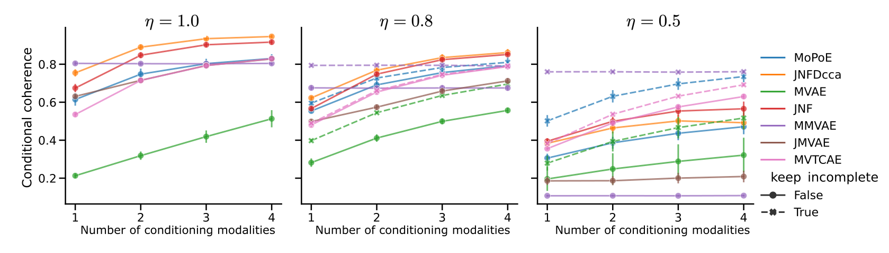
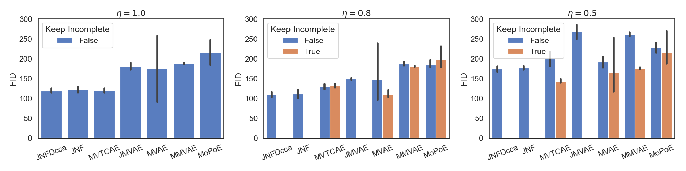

# Case Study: Benchmark model on the Incomplete PolyMNIST dataset

In this case study, we demonstrate how MultiVae can be used to perform a benchmark of models on a complex scenario. 

We evaluate 6 models on the Incomplete PolyMNIST dataset with three levels of missing data: 
- $\eta$ = 1 : no missing data
- $\eta$ = 0.8 : 20% of missing data
- $\eta$ = 0.5 : 50% of missing data

To reproduce this case study, all you need is to have MultiVae installed and the scripts in this [folder](../benchmarking_on_partial_polymnist/). 

Note on the structure of the code: in `global_config.py`, we define all the shared parameters, architectures and datasets that we use as well as the evaluation pipeline using MultiVae metrics modules. 

## Reproduce the benchmark

To launch an experiment run a command like the one below:

``` bash
python {insert_model_name}.py --keep-incomplete --seed {insert_seed} --missing_ratio {insert missing ratio}
```
Replace the brackets with the arguments of your choice. Here are the options:
- For the model_name : `jmvae`, `jnf`,`mvae`,`mmvae`,`mvtcae`,`mopoe`,`mvae`
- `--keep_incomplete`: use this argument to keep all the data even samples with missing modalities
- `--missing_ratio` : either 0, 0.2 or 0.5
- `--seed` : the seed for the experiment. 

Example:
``` bash
python mvtcae.py --keep-incomplete --seed 0 --missing_ratio 0.2
```
trains the MVTCAE model on a partial dataset with 20% of missing data but keeping incomplete samples in the mix. 

Note that for jmvae, jnf, the option --keep_incomplete can not be used as these models are incompatible with missing data. 

And there you go! You have everything to reproduce the experiments. 

## Results

You can visualize all results on this wandb workspace : https://wandb.ai/multimodal_vaes/compare_on_mmnist

We also downloaded metrics from this wandb workspace to do our own plots: (if you go to /runs, you can download everything in a csv format). 

Below are the coherences results that we obtained: 

The MoPoE, MMVAE and MVTCAE performances hold surprisingly well to large percentages of missing data!

We also compared the FID values:


## Additional Analysis of the models

All the models trained for this case-study are available on HuggingFace. 

If you want, you can run additional analysis on these models by reloading them. 

For instance:
- with the script `clustering.py` we reload the models to compute clustering metrics for each model. 
- with the script `samplers.py` we reload the models to compute the joint coherence with different samplers. 

# TODO : clean scripts and add results. 
