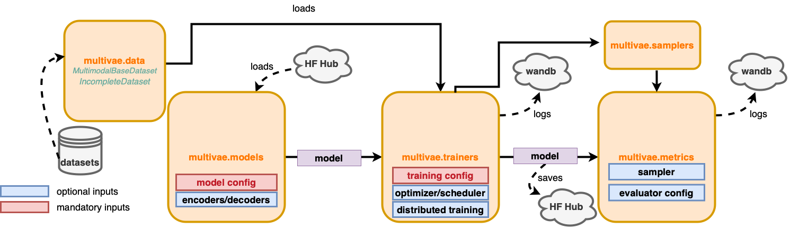

# Summary

In recent years, there has been a major boom in the development of multimodal
machine learning models. Among open topics, representation (fusion) and genera-
tion of multimodal data are very active fields of research. Recently, Multimodal
Variational Autoencoders (VAEs) have been attracting growing interest for both tasks, thanks
to their versatility, scalability, and interpretability as probabilistic latent variable
models. They are also particularly interesting models in the partially observed
setting, as most of them can learn even with missing data. 
This last point makes them particularly interesting for research fields such as the medical field, where missing data are commonplace.

In this article, we present
MultiVae, an open-source Python library for bringing together unified imple-
mentations of multimodal VAEs. It has been designed
for easy, customizable use of these models on fully or partially observed data. This
library also facilitates the development and benchmarking of new algorithms by integrating
several popular datasets, variety of evaluation metrics and tools for monitoring and
sharing models. 

# Multimodal Variational Autoencoders
In Multimodal Machine Learning, two goals are generally targeted:
(1) Learn a shared representation from multiple modalities;
(2) Learn to generate one missing modality given the ones that are available.

Multimodal Variational Autoencoders aim at solving both issues at the same time. These models learn a latent representation $z$ of all modalities in a lower dimensional common space and learn to *decode* $z$ to generate any modality [@suzuki_survey_2022].  
Let $X = (x_1, x_2, ... x_M)$ contain $M$ modalities. In the VAE setting, we suppose that the generative process behind the observed data is the following:
\begin{align}
&z \sim p(z)
& \forall 1 \leq i \leq M, x_i|z \sim p_{\theta}(x_i|z)
\end{align}
where $p(z)$ is a prior distribution that is often fixed, and $p_{\theta}(x_i|z)$ are called *decoders* and are parameterized by neural network. 
Typically, $p_{\theta}(x_i|z) = \mathcal{N}(x_i, \mu_{\theta}(z), \sigma_{\theta}(z))$ where $\mu_{\theta}, \sigma_{\theta}$ are neural networks.
We aim to learn these *decoders* that translate $z$ into the high dimensional data $x_i$. At the same time, we aim to learn an *encoder* $q_{\phi}(z|X)$ that map the multimodal observation to the latent space. $q_{\phi}(z|X)$ is also parameterized by a neural network. 
Derived from variational inference [@kingma], the VAE objective writes:
$$\mathcal{L}(X) =  \mathbb{E}_{q_\phi(z|X)}\left( \sum_i \ln(p_{\theta}(x_i|z)) \right) - KL(q_{\phi}(z|X)|p(z))$$

A simple interpretation of this objective is to see that the first term is a reconstruction loss and the second term is a regularization term that avoids overfitting. A typical training of a multimodal VAE consists in encoding the data with the encoder, reconstructing each modality with the decoders and take a gradient step to optimize the loss $L(X)$. 

Most multimodal VAEs differ in how they construct the encoder $q_{\phi}(z|X)$. In Figure \autoref{types_vae}, we summarize several approaches:
Aggregated models [@wu:2018; @shi:2019; @sutter:2021] use a mean or a product operation to aggregate the information coming from all modalities, where joint models [@suzuki2016; @vedantam:2018; @senellart:2023] uses a neural network taking all modalities as input. Finally coordinated [@dvcca; @tian:2019] models uses different latent spaces but add a constraint term in the loss to force them to be similar. 
{width=80%}
Recent extensions of multimodal VAEs include additional terms to the loss, multiple or hierarchical latent spaces to more comprehensively describe the multimodal data. Aggregated models have a natural way of learning on incomplete datasets: for an incomplete sample $X$, we use only the available modalities to encode the data and compute the loss $l(X)$. However, except in MultiVae, there doesn't exist an implementation of these models that can be used on incomplete datasets in a straightforward manner. 

Another application of these models is data augmentation: from sampling latent codes $z$ and decoding them, fully synthetic multimodal samples can be generated. Data augmentation has been proven useful in many deep learning applications. In MultiVae we propose different ways of sampling latent codes $z$ to further explore the generative abilities of these models. 

# Statement of need

Although multimodal VAEs have interesting applications in different fields, the lack of easy-to-use and verified implementations might hinder 
applicative research. With MultiVae, we offer unified implementations, designed to be easy to use by non-specialists and even on incomplete data. To this end, we offer online documentation and tutorials. In order to propose reliable implementations of each method, we tried to reproduce, whenever possible, a key result from the original paper. 
Some works similar to ours have grouped together model implementations: the Multimodal VAE Comparison Toolkit includes 4 models and the Pixyz library groups 2 multimodal models. The work closest to ours and developed in parallel is the multi-view-ae library [@aguila:2023], which contains a dozen of models. Nevertheless, we are convinced that our library complements what already exists: our API is quite different, the models implemented are not all the same, and for those we have in common, our implementation offers additional parameterization options. Indeed, for each model, we've made sure to offer great flexibility on parameters and to include all implementation details present in the original codes that boost results. What's more, our library offers numerous additional features: compatibility with incomplete data, which we consider essential for real-life applications, and a range of tools dedicated to the research and development of new algorithms: benchmark datasets, metrics modules and samplers, for testing and analyze models. Our library also supports distributed training and straightforward model sharing via HuggingFace Hub. 
In this way, our work complements existing work and addresses different needs. 

# Description of the software

 Our implementation is based on PyTorch and is inspired by the architecture
of [@pythae]. The implementations of the models
are collected in the module `multivae.models`. Each model class is accompanied by a configuration dataclass gathering the collection of any relevant hyperparameter which enables them to be saved and loaded straightforwardly. The models are
implemented in a unified way, so that they can be easily integrated within the `multivae.trainers`.
Trainers are also accompanied by a training configuration dataclass used
to specify any training-related hyperparameters (number of epochs, optimizers, schedulers, etc..).
Models that have a multistage training [50, 40] benefit from their dedicated trainer that makes
them as straightforward to use as other models. Partially observed datasets can be
conveniently handled using the `IncompleteDataset` class that contains masks informing on missing
or corrupted modalities in each sample. For Data Augmentation purposes the module `multivae.samplers` regroups different ways generating fully synthetic data. 
Finally, the MultiVae library also integrates an evaluation
pipeline for all models with common metrics such as likelihoods, coherences, FID scores [18] and
visualizations. 
{width=80%}

# List of models and features

|Model or Feature|MultiVae|multi-view-ae|
|--|--|--|
|JMVAE| 	&#x2713;* |	&#x2713;|
|MVAE| 	&#x2713;*|	&#x2713;|
|MMVAE|	&#x2713;*|	&#x2713;|
|MoPoE|	&#x2713;*|	&#x2713;|
|DMVAE|	&#x2713;|	&#x2713;|
|MVTCAE|	&#x2713;|	&#x2713;|
|MMVAE+|	&#x2713;*|	&#x2713;|
|CMVAE|	&#x2713;||
|Nexus|	&#x2713;||
|CVAE|	&#x2713;||
|MHVAE|	&#x2713;||
|TELBO|	&#x2713;||
|JNF|	&#x2713;||
|MCVAE||	&#x2713;|
|mAAE||	&#x2713;|
|DVCCA||	&#x2713;|
|mWAE||	&#x2713;|
|mmJSD||	&#x2713;|
|gPoE||	&#x2713;|
|Support of Incomplete datasets|	&#x2713;||
|GMM Sampler|	&#x2713;||
|MAF Sampler, IAF Sampler|	&#x2713;||
|Metrics : Likelihoods, Coherences, FIDs, Reconstruction, Clustering|	&#x2713;||
|Inline Datasets| 	&#x2713;||
|Model sharing via Hugging Face |	&#x2713;||

# Documentation
The main features are illustrated through tutorials made available either
as notebooks or scripts allowing users to get started easily. An online documentation is also made
available at https://multivae.readthedocs.io/en/latest.

# Acknowledgements

# References

