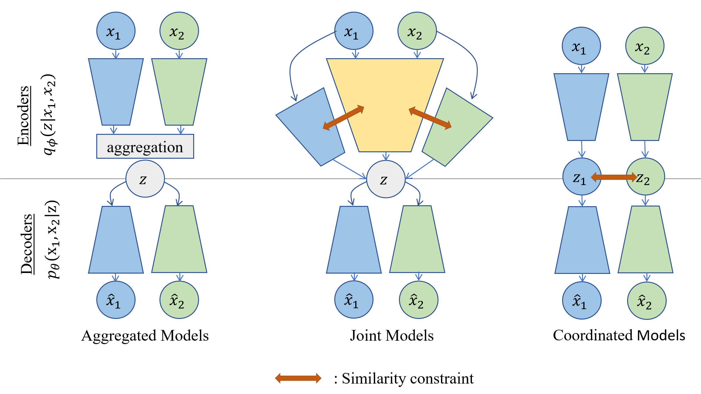

# Summary

In recent years, multimodal machine learning has seen significant growth, especially in representation learning and data generation. Recently, Multimodal
Variational Autoencoders (VAEs) have been attracting growing interest for both tasks, thanks
to their versatility, scalability, and interpretability as latent variable
models. They are particularly useful in *partially observed*
settings, such as medical applications, where available datasets are often incomplete [@antelmi:2019; @aguila:poe].

We introduce
MultiVae, an open-source Python library offering unified implementations of multimodal VAEs. It is designed
for easy and customizable use of these models on fully or partially observed data. It facilitates the development and benchmarking of new algorithms by including
standard benchmark datasets, evaluation metrics and tools for monitoring and
sharing models. 

## Multimodal Variational Autoencoders

Multimodal VAEs aim to:
(1) Learn a shared representation from multiple modalities;
(2) Generate one missing modality from available ones.

These models learn a latent representation $z$ of all modalities in a lower dimensional space and learn to *decode* $z$ to generate each modality. Let $X = (x_1, x_2, ... x_M)$ contain $M$ modalities. In the VAE setting, we define an *encoder* distribution $q_{\phi}(z|X)$ projecting the observations to the latent space, and decoders distributions $(p_{\theta}(x_i|z))_{1 \leq i \leq M}$ translating the latent code $z$ back to observations. Those distributions are parameterized by neural networks that are trained to minimize an objective function derived from variational inference. See @kingma to learn more about the VAE framework and @suzuki_survey_2022 for a survey on multimodal VAEs. 

{width=100%}

A key differentiator of multimodal VAEs relies in the choice of the encoder $q_{\phi}(z|X)$. They fall into three main categories, depicted in \autoref{fig:typesvae}. *Aggregated models* [@wu:2018; @shi:2019; @sutter:2021] use a mean or product operation to combine modalities, *Joint models* [@suzuki:2016; @vedantam:2018; @senellart:2023] use a neural network taking all modalities as input, and *Coordinated models* [@wang_deep_2017; @tian:2019] use separate latent spaces with additional similarity constraints. MultiVae unifies these approaches in a modular and extensible way. Notably, aggregated models offer a natural way of *learning* on incomplete datasets: for an incomplete sample $X$, the encoding $z$ and the objective function can be computed using only available modalities. MultiVae is the first library to provide implementations of these models with built-in support for missing data, using masks during loss computation.

## Data Augmentation
Another application of VAEs is Data Augmentation (DA): by sampling new latent codes $z$ and decoding them, *fully synthetic multimodal* samples can be generated to augment a dataset. 
This approach has been successfully used with unimodal VAEs to augment datasets for data-intensive deep learning applications [@chadebec_DA]. However, it remains underexplored in the multimodal setting. 
MultiVae includes a `multivae.samplers` module with several sampling strategies to further explore the generative abilities of these models. 

# Statement of Need

Despite the usefulness of multimodal VAEs, the lack of easy-to-use and verified implementations might hinder 
applicative research. MultiVae offers unified implementations, designed to be accessible even for non-specialists. We ensure reliability by reproducing key results from original papers whenever possible.

Related libraries contain implementations of Multimodal VAEs: the [Multimodal VAE Comparison Toolkit](https://github.com/gabinsane/multimodal-vae-comparison) [@sejnova:2024], [Pixyz](https://github.com/masa-su/pixyz/blob/main/examples/jmvae.ipynb) [@suzuki2023pixyz] and [multi-view-ae](https://github.com/alawryaguila/multi-view-AE) [@Aguila2023] that is most closely related to us and released while we were developing MultiVae.

 We compare in a summarizing table below, the different features of each work. MultiVae differs and complements existing software packages in key ways: it supports **incomplete datasets**, which we consider essential for real-life applications, as well as **generative samplers**, **benchmark datasets** and **metrics** to facilitate research. It contains a large range of models with a great flexibility on parameters' choices and including all implementation details present in the original codes that improve performance.  
 

## List of Models and Features
We list models and features in each work. Symbol ($\checkmark$*) indicates that the implementation includes additional options unavailable in the others.

|Models/ Features           |Ours     |@Aguila2023|@sejnova:2024| @suzuki2023pixyz
|---------------------------|-------|-------|-------|-------|
|JMVAE [@suzuki:2016]       | 	$\checkmark$* |	$\checkmark$| |$\checkmark$|
|MVAE [@wu:2018]             | 	$\checkmark$*|	$\checkmark$|$\checkmark$|$\checkmark$|
|MMVAE [@shi:2019]           |	$\checkmark$*|	$\checkmark$|$\checkmark$| |
|MoPoE [@sutter:2021]        |	$\checkmark$*|	$\checkmark$|$\checkmark$| |
|DMVAE [@lee:2021]           |	$\checkmark$|	$\checkmark$*|$\checkmark$||
|MVTCAE [@hwang2021multi]    |	$\checkmark$|	$\checkmark$|||
|MMVAE+ [@palumbo_mmvae_2023]|	$\checkmark$*|	$\checkmark$|||
|CMVAE [@palumbo2024deep]    |	$\checkmark$||||
|Nexus [@vasco2022leveraging]|	$\checkmark$||||
|CVAE [@kingma]              |	$\checkmark$|||$\checkmark$|
|MHVAE [@dorent:2023]        |	$\checkmark$||||
|TELBO [@vedantam:2018]      |	$\checkmark$||||
|JNF [@senellart:2023]       |	$\checkmark$||||
|CRMVAE [@suzuki:2023:mitigating]|$\checkmark$||||
|MCVAE [@antelmi:2019]||	$\checkmark$|||
|mAAE||	$\checkmark$|||
|DVCCA [@wang_deep_2017]||	$\checkmark$|||
|DCCAE [@dccae]|| $\checkmark$|||
|mWAE||	$\checkmark$|||
|mmJSD [@sutter:mmjsd]||	$\checkmark$|||
|gPoE [@aguila:poe]||	$\checkmark$|||
|Support of Incomplete datasets|	$\checkmark$||||
|GMM Sampler|	$\checkmark$||||
|MAF Sampler, IAF Sampler|	$\checkmark$||||
|**Metrics**: {Likelihood, Coherences, FIDs, Reconstruction, Clustering}|	$\checkmark$|||
|Benchmark Datasets| 	$\checkmark$||$\checkmark$|||
|Model sharing via Hugging Face |	$\checkmark$||||

# Code Quality and Documentation
MultiVae is available on [GitHub](https://github.com/AgatheSenellart/MultiVae) and Pypi, with full documentation at [https://multivae.readthedocs.io/](https://multivae.readthedocs.io/).
The code is unit-tested with 94% coverage. We provide **tutorials** either as notebooks or scripts allowing users to get started easily. To further showcase how to use our library for research applications, we provide detailed *case studies* in the documentation.

# Acknowledgements

We are grateful to the authors of the initial implementations of the models included in MultiVae. 
This work benefited from state grant managed by the Agence Nationale de la Recherche under the France 2030 program,
AN\-23-IACL-0008.
This research has been partly supported by the European Union under the (2023-2030) ERC Synergy Grant 101071601. 

# References

